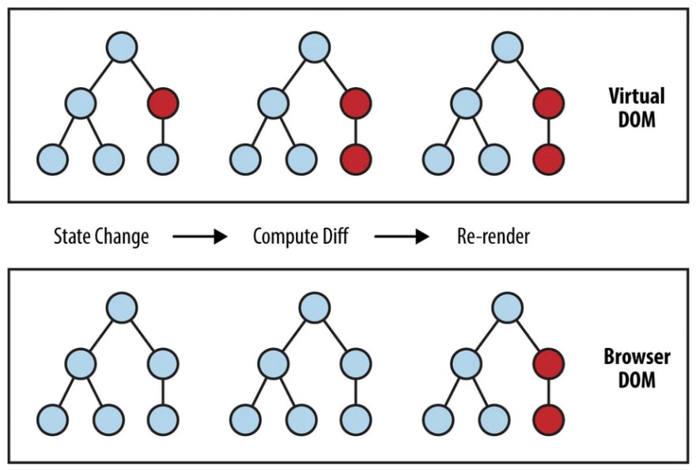

## What is DOM?

DOM(Document Object Model) is a Tree-Structured object that lets JavaScript to use HTML tags.

In other words, DOM is more like a bridge in between HTML/CSS and JavaScript.

## Then what is Virtual DOM?

Virtual DOM is also a DOM but is composed of React elements, not HTML elements.

If DOM nodes get change 30 times in layouts(reflow), colors, data change, etc, re-rendering of the DOM will happen exactly 30 times.

Meanwhile, Virtual DOM is trying to achieve the same result of 30 DOM changes in minimum DOM manipulation.

>Well, **rendering** is the React engine process walking through the virtual DOM *and collecting the current state, props, structure, desired changes in the UI, etc.*   
> React now updates the virtual DOM using some calculations and also compares the new result with the actual DOM on the page. This calculating and comparing is what the React team officially calls **“reconciliation”**, and if you’re interested in their ideas and relevant algorithms, you can check the official docs. [Reference](https://geekflare.com/react-rendering/)

>Virtual DOM is like **a double buffering**. After any change happens, apply it to the *Offline DOM Tree* which is not being rendered but a copy of actual DOM. Then, React will track down which has been changed(so called rendering)  
After all the calcuation on the Offline DOM Tree(so called reconciliation), it bundles all changes and apply it to the actual DOM. This is called *Commit*. Hence, actual DOM will calculate layouts and re-render in a bit bigger scale **but only once.**   
The same goal can be achieved by DOM fragment as well but the whole reason of using Virtual DOM is to make that DOM fragment calculation automated and abstracted. And also it will automatically track down all the nodes in an efficient way that you even don't have to care about anything.
[Reference](https://saiki.hashnode.dev/the-one-thing-that-no-one-properly-explains-about-react-why-virtual-dom)

## The steps to update DOM with Virtual DOM

1. If there is a state changes (data update or layout changes), apply the UI in Virtual DOM.
2. Compare the previously marked Virtual DOM and the upcoming Virtual DOM.
3. Re-render only nodes that required to be re-rendered.

## In Summary...

* VirtualDOM is not an actual DOM but has React elements(which are JavaScript Objects).
* It works like a double buffer.
* It compares *before change* and *after change*. If there are DOM nodes to be updated, re-render only that nodes.

 
Readings

* [The one thing that no one properly explains about React — Why Virtual DOM](https://saiki.hashnode.dev/the-one-thing-that-no-one-properly-explains-about-react-why-virtual-dom)
* [React Rendering](https://geekflare.com/react-rendering/)
* [How browsers work](https://web.dev/howbrowserswork/)